# AcousticPose Anonymous Project Page

Static GitHub Pages site for the anonymous AcousticPose project page.

The website is the primary reviewer-facing artifact. This README mirrors the important visual evidence so the repository front page is also inspectable: video proof reels, result graphs, code/data notes, and deployment instructions.

## Video Proofs

Green landmarks are video-derived references. Orange landmarks are reconstructed from the audio track only. The animated previews below play directly inside the GitHub README. The full MP4s are linked under each preview and render with controls on the deployed GitHub Pages site.

### Case 1: CREMA-D Held-Out Proof

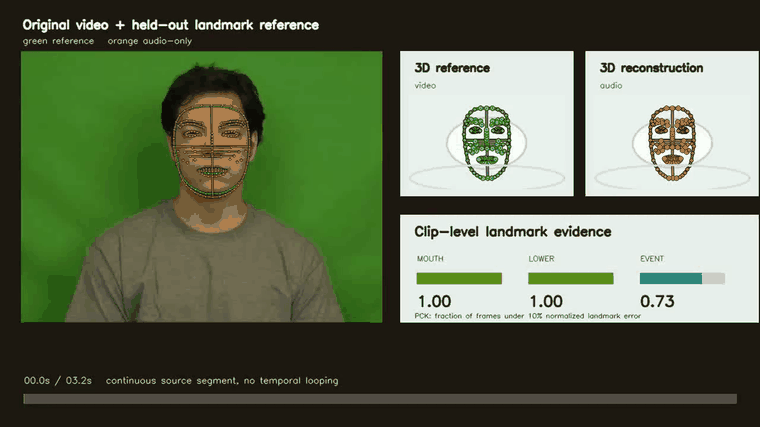

[Open full MP4 with controls](assets/demos/landmark_proof_case_01_CREMA-D_1031_IWL_ANG_XX.mp4)

### Case 2: RAVDESS Held-Out Proof

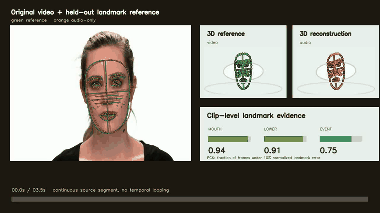

[Open full MP4 with controls](assets/demos/landmark_proof_case_02_RAVDESS_01-01-06-02-02-02-14.mp4)

### Case 3: MELD Held-Out Proof

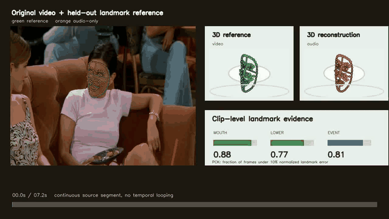

[Open full MP4 with controls](assets/demos/landmark_proof_case_03_MELD_dia450_utt11.mp4)

### Case 4: CREMA-D Held-Out Proof

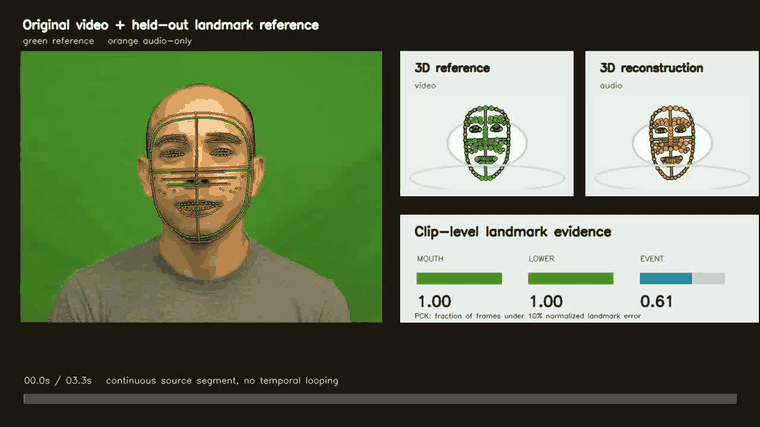

[Open full MP4 with controls](assets/demos/landmark_proof_case_04_CREMA-D_1040_WSI_DIS_XX.mp4)

### Case 5: CREMA-D Held-Out Proof

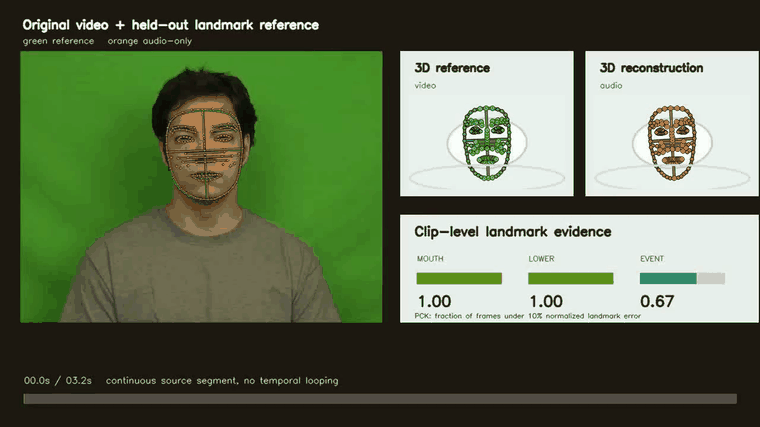

[Open full MP4 with controls](assets/demos/landmark_proof_case_05_CREMA-D_1031_TIE_FEA_XX.mp4)

## Result Graphs

### Main Evidence Board

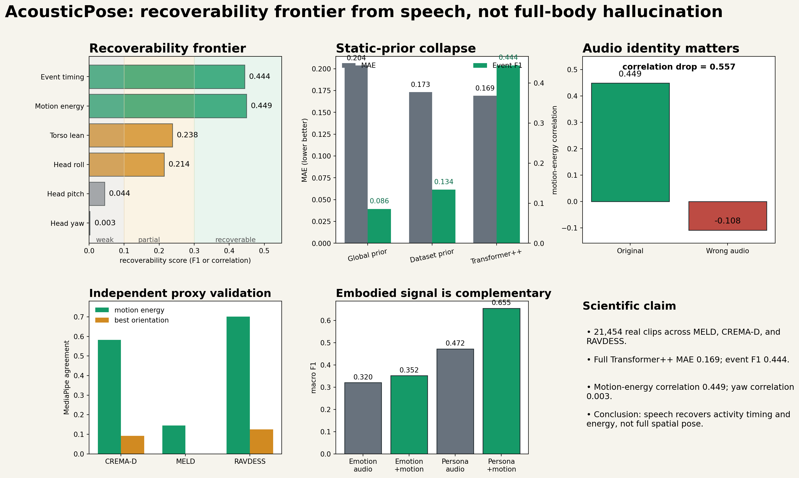

### Static-Prior Trap

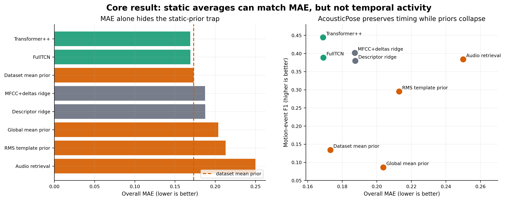

### Recoverability Frontier

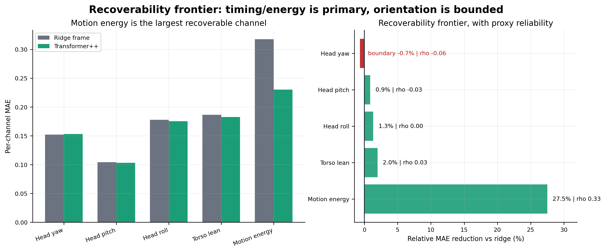

### Mechanism and Negative Controls

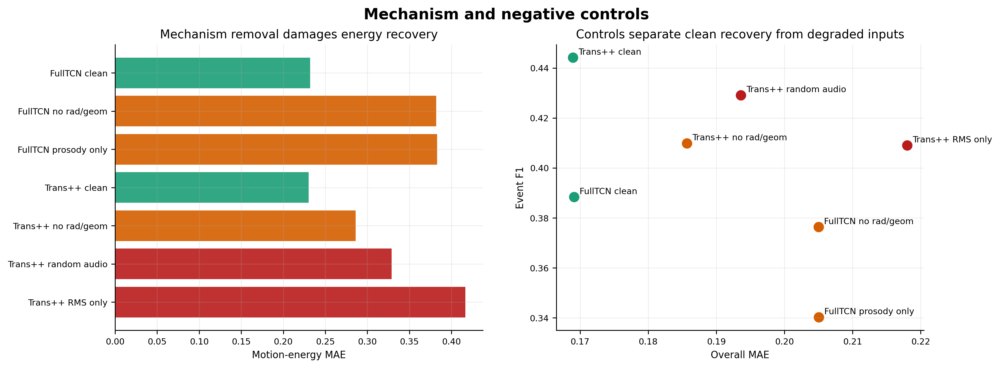

### Proxy Confidence

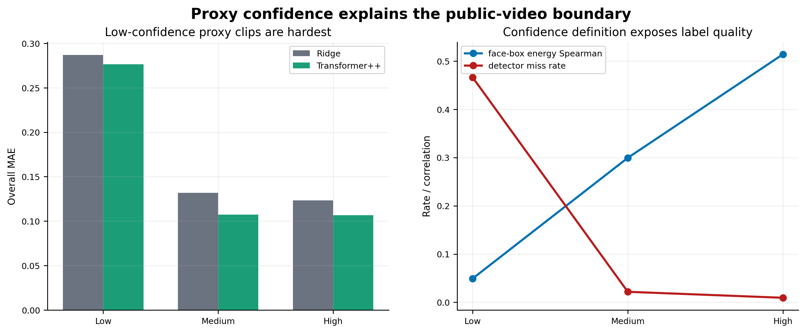

### Raw-Audio Robustness

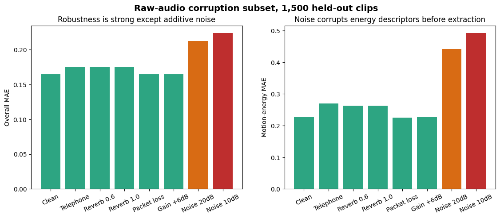

## Code and Data

The page includes:

- synchronized held-out visual proof reels
- paper-facing result figures
- code/data reproducibility section
- downloadable code script archive
- public-dataset provenance for MELD, CREMA-D, and RAVDESS

Datasets used:

- MELD
- CREMA-D
- RAVDESS

Raw videos are not redistributed here; use the original dataset providers for raw data access.

## Deploy on GitHub Pages

1. Create a new GitHub repository.
2. Upload every file in this folder to the repository root.
3. In the repository settings, open `Pages`.
4. Set `Build and deployment` to `GitHub Actions`.
5. Push to `main`.

The included workflow at `.github/workflows/pages.yml` deploys the static site automatically.

After the first deployment, the permanent URL will be:

```text
https://<github-username>.github.io/<repository-name>/
```

Use that URL in the manuscript instead of any `trycloudflare.com` link.

## Local Preview

From this folder:

```bash
python3 -m http.server 4173
```

Then open:

```text
http://localhost:4173
```

## Notes

GitHub's repository README renderer does not reliably render local HTML5 video tags. For that reason, the README uses animated GIF previews that play inline, while the deployed GitHub Pages site renders the MP4 videos normally with controls.
